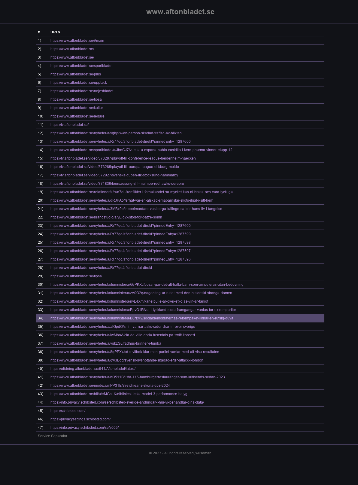

## URL Viewer Tool

### Preview

### Overview

URL Viewer is a browser extension designed to extract and display all URLs from the active webpage. 

This tool is useful for quickly gathering all the links on a page and viewing them in a separate, cleanly formatted window.

### Features

- Extracts all URLs from the current webpage.
- Displays the URLs in a new tab with a simple and readable format.

### How to Use

1. Click on the URL Viewer extension icon in your browser.
2. A popup with a "Dump URLs" button will appear.
3. Click on "Dump URLs" to view all the URLs from the current page in a new tab.

### Components

- `manifest.json`: Configuration file for the extension.
- `popup.html` and `popup.js`: Creates the popup interface with the "Dump URLs" button.
- `background.service_worker.js`: Listens for the click event from the popup and triggers URL dumping.
- `contentScript.js`: Contains the main logic for extracting URLs and displaying them.
- `content.js`: An additional script for URL extraction (seems to have a placeholder for further development).

### Permissions

- Active Tab: To access and extract URLs from the current tab.
- Scripting: To execute scripts for extracting URLs.

### Developer Notes

- The extension is designed with simplicity and ease of use in mind.
- Future updates might include additional features such as filtering URLs or exporting them to different formats.

### Credits

Developed by wuseman @ Nr1.nu
